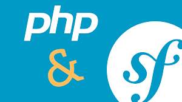

# mvc/report

Detta är information om report-sidan av mitt arbete i kursen mvc. Det finns en enkel webbplats med kort presentation av mig och kursen, samt redovisningstexter för de olika kursmomenten.

---

## Översikt

- **Innehåll:** Presentation, information om kursen, redovisningstexter och JSON API.
- **Tekniker som används:** Symfony, Twig, Encore, Git.

---

## Projektets struktur

- public/ – Innehåller publika delar såsom bilder.
- src/ – Här ligger själva PHP-koden för controllers.
- templates/ – Twig-mallarna för layout.
- assets/ – CSS, JavaScript och bilder hanterade med Encore.

---

## Hur du kommer igång

### Klona projektet
```bash
git clone git@github.com:rosa24-bth/mvc-report.git
```

### Installera beroenden
```bash
composer install

npm install
```

### Starta lokal Symfony server
```bash
symfony server:start
```

Öppna sen https://127.0.0.1:8000 i din webbläsare.

### Badges från Scrutinizer

[](https://scrutinizer-ci.com/g/rosa24-bth/mvc-report/?branch=main)

[](https://scrutinizer-ci.com/g/rosa24-bth/mvc-report/?branch=main)

[](https://scrutinizer-ci.com/g/rosa24-bth/mvc-report/build-status/main)
